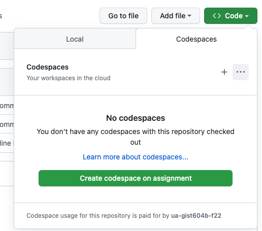

# Assignment: Codespaces Intro (Hello World Python)
## Background

We have talked a lot about cloud resources in this class. Generally speaking, cloud resources are compute resources like virtual machines, storage, web services, etc., that are hosted by a third party, aka "cloud provider". Cloud resources are not free and are typically charged to the user in small amounts based on the number, size, or duration of the resources that the customer is using. If you want to pay for storage, for example, you might pay per GB per month. For virtual computers you may pay per CPU per minute. For network usage you may pay per GB transferred. 

With that said, a lot of cloud providers provide minimal amounts of cloud resources for free. In this class, github provides us with a number of cloud resources that are free (like hosting our files and running out CI jobs in runners). Premium services allow greater resources, higher priority resources, and additional services. One such service we will use for the rest of the semester is called Code Spaces. GitHub provides this premium service to us for free as Educational users. 

Codespaces are Virtual Machines provided to GitHub users to interact with their git repos in an advanced development environment. Learn more at https://github.com/features/codespaces. 

## Directions

1. Create a new branch named `assignment`.

2. Click on the "Code" button and select "Codespaces" to open a drop-down menu with the normal `Local` (clone) tab and also a `Codespaces` tab. 

Click on the `Codespaces` tab and then the big green button for `Create codespace on assignment`.

Note that this will create a new `Codespace` VM environment and associate it with the `assignment` branch. 

When you do, it will open another browser tab where your environment will be set up. You can interact with this environment through this browser tab. It will not live long if you are not working with it actively so it will be up to you to save any work you have before letting it go idle for too long. When it has finally loaded it will look like this:

This environment is running [Microsoft Visual Studio Code](https://code.visualstudio.com/). This is an Integrated Development Environment, or IDE. It is [open sourced under the MIT license](https://github.com/microsoft/vscode). An IDE is a glorified text editor with built-in tools optimized for editing and interacting with programs. You may be familiar with another IDE, `PyCharm`, from another class.

